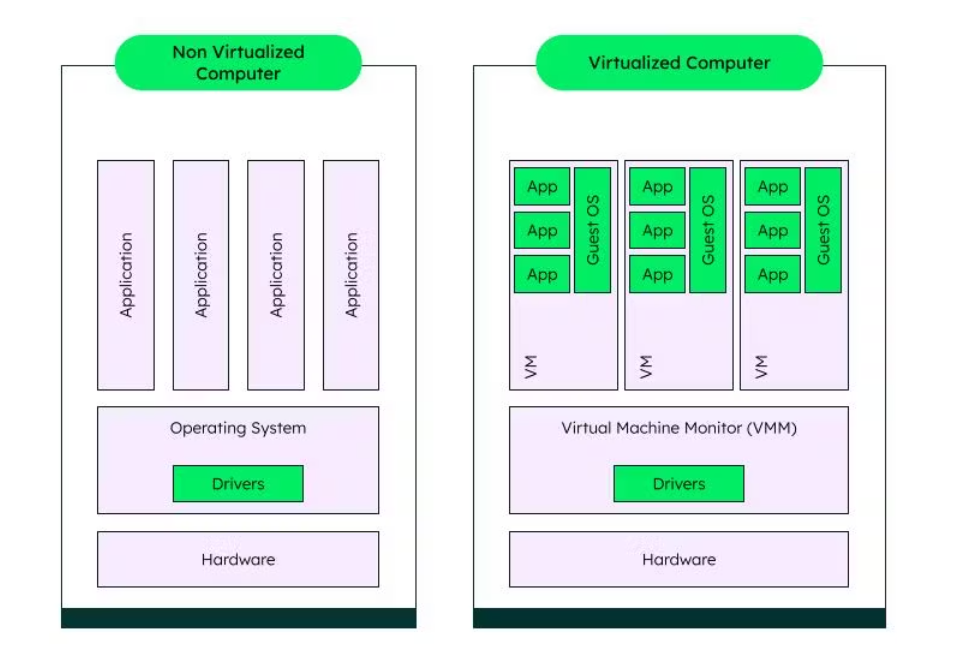

# LC3 Virtual Machine

### What is a virtual machine?
**Reference:**
- [A Guide to Virtual Machines (VM)](https://www.mongodb.com/resources/basics/cloud-explained/virtual-machines)

A ***virtual machine (VM)*** is an application that functions as a virtual computer but resides within a physical computer (e.g., a host computer). Often referred to as guest machines, virtual machines work as separate independent machines but run as a process on the host machine's operating system. However, both the physical computer and the virtual machine believe they are each interacting with a separate physical machine. This is important because it keeps the host and guest machines from cannibalizing the other's resources, as well as enabling the use of guest operating systems by the VMs as they focus on specific tasks which are separate from the physical machine's functions.

### How virtual machines work
In the illustration below, a *non-virtualized computer* (e.g., physical machine) and a *virtualized computer* (e.g., virtual machine) are depicted.

    

